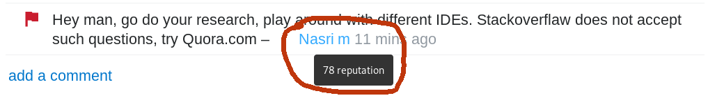

  A collection of strategies and approaches all (almost) learned the hard way. They range from the good to the evil, intended to get the unsuspecting going and getting along on the rugged terrain of the [Stack Overflow](https://stackoverflow.com/) ("SO") site and its diverse population. This isn't a moralistic or political endevour, it is about navigating circumstances that you otherwise can't change (right now - [later](https://stackoverflow.com/questions/18093928/what-does-could-not-find-or-load-main-class-mean) may be a different thing). You'll encounter enough morality wrecking havoc on SO. If you think it is spineless and opportunistic: that's intentional.

  "You're a [repwhore](https://meta.stackexchange.com/questions/281787/it-s-time-to-retire-the-term-rep-whore)!"
  "You bet I am."

  

      public enum  SosApproach { 
  &nbsp;&nbsp;&nbsp;&nbsp;GOOD, LEGITIMATE, QUESTIONABLE, EVIL 
  } 
  

  May the tips guide your journey, just as they led me in the barren and hostile desert of Java Q/A from the dark abyss of insignificance (and the ultimate minimum of privileges on stack overflow) to the high ridges of fame, glazing in the sun of admiration beyond [1K](https://stackoverflow.com/users/1428369/gurioso?tab=reputation) reputation within about 2 months. You should google Jon Skeet [now](https://www.google.com/search?q=jon+skeet).

    put on hold as off-topic by <a href="https://stackoverflow.com">Qwertz</a>, <a href="https://stackoverflow.com">rolansky</a>, <a href="https://stackoverflow.com">foolproof</a>, <a href="https://stackoverflow.com">Filibuster</a>, <a href="https://stackoverflow.com">Yummy</a> 54 mins ago   

    This question appears to be off-topic. The users who voted to close gave this specific reason:  

    "This question was caused by a problem that can no longer be reproduced or is a simple typographical error."   

  If this question can be reworded to fit the rules in the <a href="https://stackoverflow.com/help/on-topic">help center</a>, please edit the question. 

  There's lot of ruckus on and off SO how [rough](https://meta.stackoverflow.com/questions/251758/why-is-stack-overflow-so-negative-of-late) it [actually](https://stackoverflow.blog/2018/04/26/stack-overflow-isnt-very-welcoming-its-time-for-that-to-change/) [is or isn't](https://hackernoon.com/the-decline-of-stack-overflow-7cb69faa575d) (depending or not depending on your reputation), and if it should be [more](https://meta.stackoverflow.com/a/373509/1428369), [much](https://meta.stackoverflow.com/questions/252506/question-quality-is-dropping-on-stack-overflow) more, or [less](https://meta.stackexchange.com/questions/138173/etiquette-for-posting-civil-and-informative-comments/) rough. Coming from SO staff, from SO regulars and from bystanders and all these groups [disagree](https://meta.stackoverflow.com/a/252077/1428369) mutually as well as internally.

  Not my business. I peddle tips, can't harm in any case (liability excluded).

### legend
  - SO ... stack overflow
  - OP ... original [post(er)](https://meta.stackoverflow.com/questions/253162/what-is-an-op-when-referring-to-stack-exchange)
  - rep ... reputation

## When answering

  - **GOOD** Read Jon Skeet's advise on [answering questions](https://codeblog.jonskeet.uk/2009/02/17/answering-technical-questions-helpfully/) at least once.

  - **GOOD** Hunt for [bounties](https://meta.stackexchange.com/questions/16065/how-does-the-bounty-system-work), obviously.

  - **GOOD** Pick proper questions. Answering questions that are considered [bad](https://meta.stackoverflow.com/questions/281793/stance-on-answering-bad-questions) attracts down-votes of the **answer** too. The more safe bets are questions where the reply is a snippet of code (garnished with some phrases for the literary appeal).

  - **GOOD** Resilience. That's not the Nobel price commission descending on you judging the worthiness of your contribution for mankind. It may rather be a maladjusted jobless freak with a computer and too much time or a some deviant students burning the subsidies they get from their parents. When getting down-voted, improve and try again.

  If you're lucky and someone commented what actually was wrong, use the information, and drop the emotional content (if negative). Don't get into comment wars, you can't win, but you can get reputation deducted.

  - **GOOD** Remain respectful, also in the face of an hair raising OP. Apart from any moral aspect you're creating a barrier for the questioner to accept (+15!) your answer, when, while maybe correct and technically helpful, it conveys a judgment about the OP being e.g. an incompetent, pretentious idiot. Watch your words, contempt may even ooze out between the lines. Outright unfriendly comments or worse will get you warnings or bans.

  Display of respectful communication might also be a trigger that earns you up-votes (+10 each), I do suspect. In any case it creates a distinctly satisfying experience, IMHO, to treat others as human beings despite technical shortcomings, instead of snapping at them. Unless you've the misfortune of being a clinical psychopath [(F60.2)](https://www.icd10data.com/ICD10CM/Codes/F01-F99/F60-F69/F60-/F60.2).

  - **GOOD** Edit other posts. You're entitled to do so from the start, each accepted edit earns you +2, until you hit the edit reputation cap at 2000. Makes stuff easier to find, to comprehend and nicer to look at.

  Easy wins are code formatting, right now also weeding out non-gender-neutral addressing of the audience ("Hello, guys") instead of staging [political fights](https://meta.stackexchange.com/questions/336366/post-for-clarifications-on-the-updated-pronouns-faq) about it, adding detailed information ("I'm using a scanner" -> "I'm using java.util.Scanner") or setting stuff straight ("I'm using an array" -> its often an ArrayList actually), adding missing tags or re-tagging the post (e.g. `java` gets time and again confused with `javascript`). Tag edits will yield +2 also above 2K, the barrier is at 20K.

  - **GOOD** Maximize quality, attend to your posts. Better quality, more up-votes. Come back to the posters when they commented stuff like "Great answer, I'll try that first and accept later", then they forget the latter. Also on a second (or third) glance you may see glitches that eluded you before, and it will bring the answer to the fore again as an active posts. Don't overdo it, otherwise the answer becomes property of the [community wiki](https://meta.stackexchange.com/questions/11740/what-are-community-wiki-posts) and [yields no more reputation](https://meta.stackoverflow.com/a/315705/1428369).

  - **GOOD** Answer to the topic more than to the question. Some questions are stated poorly or are absolutely not persueable, still the topic may yield rep. E.g. there was the guy who asked, [which type of grammar Haskell has](https://stackoverflow.com/questions/59092560/what-kind-of-grammar-does-haskell-have/59092833#59092833). Poor formulation. What he meant was, by which type of parser it may be parsed. He wanted to build a Haskell->Java cross compiler (very hard to impossible and useless).
  One comment was *"If you have to ask this question, then you have no hope of completing that highly ambitious project"*. How informative and encouraging.

  Actually pinning down, what the issues were made for some interesting research and answer (+40), perhaps +10 coming from the critical commentator, I referred to him personally (@hisName), he looked at the answer, found his position corroborated (the "very ambitious" part) with his name mentioned, and of course liked that.

  - **LEGIT** Be the fastest gun in the west ([FGITW](https://meta.stackexchange.com/questions/18014/what-is-fgitw-and-scite))! Have your IDE up and running and google's search page open. It's horrible to have an answer at your fingertips while IntelliJ keeps on indexing. Create an **acceptable** answer (not a trash answer), publish it asap, cash in on up-votes, then edit and improve. It's [a bit debated](https://meta.stackexchange.com/questions/89712/potential-fgitw-fix), yet legit.

  - **LEGIT** Garnishing. Add additional explanation and links to the post once it is out. Some text and links seems to impress people more than bare bone code. References in general, to scientific papers in particular and stuff like the Java language specification seem to impress (and may be helpful too).

  - **LEGIT** Choose your time. Occasionally you may find yourself in a swarm of lightning fast predators hunting for reputation. You realize it when you see a pristine OP just 15 seconds old, place your answer 2 minutes later, just to find out that you're the 4th to do so. More often its just one - well - co-contributor.

  You can choose less crowded moments. Nobody's online every day. People have changing wake/sleep patterns, different time zones and sometimes real work to do also. After a while you know each of the quick co-inhabitants of the ecosystem intimately and can write another article about its behavior. You may find out that the SO interaction patterns that arise in other time zones than e.g. GMT+1 may more appeal to your preferences.

  Occasionally the site is flooded for days with homework-, debug-my-code, do-my-job and similar questions by users who just did their first post (they won't make it far on that track). Sometimes answering to them may not be appropriate at all, will likely yield no up-vote (up-vote?) or even down-votes. No approach for this found yet. Wait for holidays? By building rapport occasionally an answerable question will yield +15, hard earned +15 usually.

  - **LEGIT** Add at least a snippet of code whenever possible.
  

  String message = "The gray square conveys professionalism and deep understanding.";
  

  - **LEGIT** Minimize neural processing effort. Apply proper formatting with code sections, paragraphs, horizontal rules, quotes and all. Spell out examples in a way that the issue is *obvious at a first glance*.

  - **LEGIT** Follow up on comments, augment your answer as they unfold.

  - **LEGIT** Recycle. Maintain bookmarks of your recent answers if you think they're valuable, but didn't get the attention they deserve. There will be more occasions to put them on stage.

  - **LEGIT** Specialize, perhaps in a frequent topic that comes in many flavors and cases and can't be boiled down to *"duplicate of...single answer"*. [Vlad Michaelca](https://vladmihalcea.com/how-to-get-a-10000-points-stackoverflow-reputation/) did it with Hibernate, [BasilBourque](https://stackoverflow.com/search?q=user:642706) made piles of rep with his Java Date/DateTime expertise for example, and [Andreas](https://stackoverflow.com/users/5221149/andreas) is the character encoding guy. Very hard to beat them on their home turf.

  - **LEGIT** Be a karma-whore. If you posted an answer and the OP signaled acceptance by commenting on the line of "thank you so much, very helpful" without accepting it, ask to "consider to accept the answer by clicking the green check mark". Many new posters aren't aware of those formalities. Some just forget about the post. Come back to them in a comment and provoke a response.

  - **LEGIT** Don't reply to everybody. Some posters have the habit only to up-vote or accept, when their perceived problem is solved, which may be not the problem stated in the OP, not solvable at all, or solvable, but only in ways the OP can't understand. It is usually obvious when you look at the list of questions in their SO profile. Still you might be able to lure them into rapport and work out something that eventually gets accepted (you'll become an [unsung hero](https://meta.stackexchange.com/questions/123519/when-exactly-does-the-unsung-hero-badge-get-awarded) on that track).

  Low reputation and first time posters may not come back to their post at all, and perhaps even don't know about up-voting or accepting an answer. Only pays, if the question isn't terrible, with the potential to yield a decent answer and up-votes from other visitors.

  - **QUESTIONABLE** Local scavenging. From later answers it may be OK, if that's compatible with your moral compass. Don't try it with earlier answers, the approach will stink a mile against the wind. One could argue, that contemporary attention spans won't allow anybody to scroll past your hopefully leading answer anyway and you're serving mankind (and SO's stakeholders) by salvaging content from the otherwise unreachable depths. Was also an aspect of [SCITE](https://meta.stackexchange.com/questions/18014/what-is-fgitw-and-scite) (slowest cheater in the east)

  - **LEGIT** Scavenge all over the place. If you manage to compile one complete answer from several fragmentary ones, that's actually legit [according to one founder](https://www.joelonsoftware.com/2008/09/15/stack-overflow-launches/) (or was so in 2008).

  - **GOOD** Become Eric Lippert. Telling a [story](https://stackoverflow.com/questions/6441218/can-a-local-variables-memory-be-accessed-outside-its-scope/6445794#6445794) that conveyed the issue/answer in the form of a simile yielded him >4750 up-votes. His style [inspired user Mystical](https://meta.stackoverflow.com/a/315705/1428369) to the [highest yielding answer](https://stackoverflow.com/questions/11227809/why-is-processing-a-sorted-array-faster-than-processing-an-unsorted-array/11227902#11227902) on SO ever (>30940 up-votes, > 1600 bounty), adding illustrations to the approach. But also just spelling out some cryptic topic in human readable form [might do](https://stackoverflow.com/questions/9452701/ukkonens-suffix-tree-algorithm-in-plain-english?rq=1).

  That was up to 2012, didn't test what would happen today. If it still works and you mange to do it, you can start to look down your nose at FGITW.

  - **EVIL** Use sock puppet accounts and amplify certain answers. Take care of identical ip addresses, browser profiling and [statistical patterns](https://meta.stackoverflow.com/questions/388469/does-stack-overflow-prevent-cartels?noredirect=1&lq=1). Don't overdo it, you'll quickly get weeded out. Tried it only once, successfully (but then the OP got deleted because of its quality. The answer was essentially "1+1").

  - **EVIL** Conspire with others to create [voting rings](https://meta.stackoverflow.com/questions/373651/what-is-the-purpose-of-voting-rings). Will get you weeded out in no time. In the early days one account made it above 10K rep before being [taken out](https://meta.stackexchange.com/questions/178714/show-suspended-users-with-their-normal-reputation-in-the-data-explorer). Now they say, they're [way faster](https://meta.stackoverflow.com/a/373670/1428369).

  - **GOOD** Early bird-ism. The gold rush on SO is long gone, but one still can be early in a new field. E.g. Java once was a [fertile pasture](https://stackoverflow.com/a/309448/1428369), now its a desert. But with significant upgrades comes new supply now and then, like the [introduction of lambdas](https://stackoverflow.com/questions/25147094/how-can-i-turn-a-list-of-lists-into-a-list-in-java-8/25147125#25147125) as of 2014 (up-votes question: >450, answer: >850).

  - **GOOD** Bend the universe to your will. Create the language/framework/api that everybody uses and become the undisputed supreme being ruling its SO tag. Given you still care then about such mundane trivialities. If you do, introduce **a lot** of [odd peculiarites](https://stackoverflow.com/questions/22343224/whats-the-difference-between-tilde-and-caret-in-package-json) on a random basis.

## when commenting

  - **GOOD** Empathy, respect. Imagine you're sitting next to the OP and tell him your comment. Helps me to remain respectful and empathetic, especially when you find yourself locked in a world view that suggests, that you have to convey criticism. Sometimes people including myself seem to forget that even SO is a sort of communication platform, not just a place where some entities just throw information at each other ("A?" "B!").

  - **GOOD** Building rapport. That's when a human connection is established and communication can happen. Downside: takes time and SO discourages it [("There's no chit-chat")](https://stackoverflow.com/tour). Upside: both feel better, you can ask for stuff and actually get it (e.g. the answer accepted)

  - **GOOD** Autonomy. If find yourself among a pack of snarky conceited would-be-experts chastising a newbie: don't take it as a role model. Imitating them won't make you an in-group member anyway any time soon (break the cycle of abuse!) and won't pay off in reputation ever. Instead it will highlight you as a jerk, especially with a reputation more or less on par with the OP.

  

  - **GOOD** Cleaning up. Delete unnecessary comments after some necessary chit-chat. Some seem to think that curbs their human rights. Never occurred like that to me.

  - **GOOD** Stick to the subject. Don't go meta in the comment section of a post. Defending the seemingly underprivileged and downtrodden or questioning other users *behavior* in the comment section of a post won't change anything and may damage your reputation (in numbers!). You can flag comments that you find objectionable and let mods do the dirty work. And there's [meta.stackoverflow](https://meta.stackoverflow.com/)

  - **GOOD** Ask for the necessary clarification and details and don't bullshit. I like [this one](https://news.ycombinator.com/item?id=7650799) very much:

  *"What are you trying to do?" is probably the most passive-aggressive, most infuriating and least helpful answer to any technical question.*

  *It usually translates to "I know the answer to your question, but instead of just answering it and letting us both get on with our lives, I'd like to show off my vast intellect by helping you embark on a major re-design that you neither asked for nor need at the moment."*

## When asking

  - **GOOD** Read Jon Skeet's advise on [asking questions](https://codeblog.jonskeet.uk/2010/08/29/writing-the-perfect-question/) at least once

  - **GOOD** Resilience. You may run into more or less patient contributors, also very much depending on the quality of your post. It might not be all that great in the beginning, which may provide a stingy learning experience. Persist, improve. [Formatting](https://stackoverflow.com/editing-help) makes a great deal of a difference. And always keep in mind: you're [not](https://meta.stackoverflow.com/questions/253100/why-do-people-scare-off-new-users?noredirect=1&lq=1) [alone](https://meta.stackoverflow.com/questions/251758/why-is-stack-overflow-so-negative-of-late).

  If negativity pops up, I do recommend not to take any of it personal, not to identify single snappy comments as the soul of SO. Attempt to create posts that don't trigger anything in the most stressed out, grumpy and compulsive contributors except excellent answers (oh my god, what am I writing here?). But you might as well be well received. I kid you not.

  It gives a sense of satisfaction to be able to sail the sea in any weather.

  - **GOOD** Anger management. When you find yourself in an agitated state of emotional reactivity, leave SO until the state is gone, for half a day, say. Before you leave delete any comments made in that state.

  - **GOOD** follow the [guidlines](https://stackoverflow.com/tour). Well - nobody reads the guidelines anyway.

  **They'll snap at you, down-vote your post or delete it when you do any of these:**

  - post something off-topic, which is basically anything not directly related to writing computer programs
  - if code is involved, in the order of severeness: paste no code at all, post links to images of code, post images of code
  - paste code that doesn't compile, is badly formatted or not formatted at all (you can format it using the `{}` button).
  - dump your whole project without singling out a [minimal reproducible example](https://stackoverflow.com/help/minimal-reproducible-example)
  - copy/paste homework assignments without your solution attempts ("That's a do-my-homework question")
  - don't document your own effort you put into it and point out where and why you're stuck ("This is not a free coding/debugging service...")
  - talk about errors but post no exception, call stack and the line the exception is raised (there are no line numbers at SO)
  - don't post sample input that allows to reproduce errors
  - don't describe expected behavior along with the things the program does, but isn't supposed to do
  - sound demanding, snooty ... you know, people do it for free. Its more like asking for a favor than to get a service delivered. Well, most may also do it for reputation, but at least they're not getting paid. Only SO makes money, at least it tries to.

  - **GOOD** Patience. Even the highest rated questions do have a share of down-votes, for whatever reason. But a single up-vote cures 5 down-votes anyway as far as reputation is concernend. As soon as the audience is big enough, you can't please everyone.

  - **LEGIT** Recycle known problems not yet posted. Scan through books like "Java Puzzlers" or the bug lists of programming languages and re-formulate them as SO posts. Such bizarre and useless stuff gets [well received](https://stackoverflow.com/questions/52147247/getting-unwanted-nullpointerexception-in-ternary-operator-why) usually. Try to decorate and pack them in an appealing riddle. But it might well be, that just answering question yields a better effort-to-reputation ratio.

  - **EVIL** Re-post own or other's posts with some modification of the OP. Even if detected the post will just be closed and all reputation earned remains.

  - **GOOD** If you got down-voted to death, you obviously should work on your way of asking, or your choice of questions. Well, no, **you must, otherwise you'll get banned from asking sooner or later**. And aside from getting no answers you're causing just as much frustration as you're experiencing yourself. If it is the very first question it won't matter in that sense, since your reputation can't sink below 1.

  **You have reached your question limit**

  >  It looks like you might need a break - take a breather and come back soon!
  You've asked 1 question recently which has not been received very well by the community. Everyone learns at their own pace, and it's okay to make some mistakes. However, the reception your question has received thus far might ultimately block your account from asking questions entirely.

  - **LEGIT**   **But** if you got down-voted to death and also want to restore your SO reputation to where it was before, then just delete the post. As long as there hasn't been an answer that's supposed to be ok. Afterwards I'm not sure, but a post of that kind isn't likely to yield any answers anyway.

  Don't re-post it, though, this will get you're account blocked. And although the trick allows recovery from early disaster, don't get used to it, you'll get blocked for poor posts anyway, deleted or not.

  But don't blare this advice out all over the place. Deleting seems [officially legitimate](https://meta.stackoverflow.com/a/311812/1428369) but the mods online will still consider such an *advice* illegitimate.

  - **LEGIT** Ask tactically, topics that may yield lots of up-votes. Personally never managed to do that, though. But the question space of heavily grazed pastures like java is devoid of [low hanging fruits](https://stackoverflow.com/questions/1750435/comparing-java-enum-members-or-equals). Gone as are the days when your lifetime's desire for reputation could be satisfied by posting [one single question](https://stackoverflow.com/users/65374/user65374)

  - **LEGIT** Do as described before and answer your own question. Its acutally [encouraged](https://stackoverflow.blog/2011/07/01/its-ok-to-ask-and-answer-your-own-questions/).

  - **EVIL** Create sock puppet accounts or voting rings ut up-vote your awful questions in order not to get banned. Still, Evil and [counter-productive](https://meta.stackoverflow.com/a/373670/1428369). A quote from the link:

  *One consulting company listed all their employees' Stack Overflow profiles on their front page, and became quite upset with us when they all were suspended at the same time. I imagine that didn't help them get clients.*
